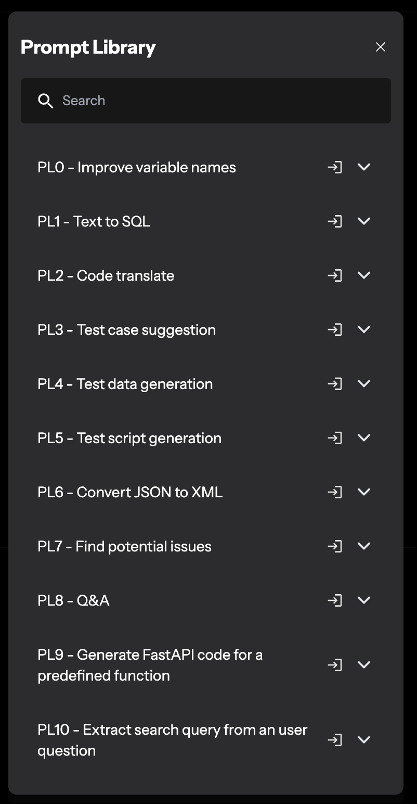

# CodeVista: AI Coding Assistant
### Interactive AI-Powered Coding Assistant by FPT Software AI Center

---

CodeVista, developed by the AI Center at FPT Software, enhances coding efficiency through an AI-driven, interactive prompting interface. Ideal for developers seeking streamlined coding assistance.

CodeVista is 100% free to use for FPT Software users.

---

## Key Features

#### Interactive Prompting: 
Engage with CodeVista by asking questions or commanding coding tasks through a simple input box.

#### Context-Rich Guidance: 
Utilize your own code as context for tailored assistance by referencing code snippets with `@` in your prompts.

#### Prompt Library: 
Access over 50 ready-to-use coding prompts for common tasks like explaining, commenting, and fixing code.

#### Predefined Actions: 
Use predefined commands such as `/explain`, `/feedback`, and `/fix`, etc. for specialized tasks, along with a unique `/web-search` for integrating Google search results directly into your workflow.

#### Structured Formatting: 
Request outputs in various formats including markdown, JSON, and XML, ensuring compatibility with your project requirements.

---

## How to install CodeVista?

### CodeVista for VS Code

- Get the latest version of the CodeVista extension from [Marketplace](https://marketplace.visualstudio.com/items?itemName=AIC.codeVista).

- Alternatively, you can also search for CodeVista extension directly in VS Code.

There are two versions of CodeVista on VS Code extension marketplace:

**CodeVista: AI Coding Assistant(FPT Internal)**: This is the version managed by FSoft Internal IT team. If you are FPT developers of a project line managed by FSoft, you should use this version.

**CodeVista – AI Coding Assistant**: This is the version managed by AIC team. This version is for anyone who is a developer.

- After installation, the CodeVista extension should be enabled automatically.

- If not, you can enable it manually by clicking the "Reload" button in the Extensions view.

- If CodeVista is installed successfully, the side activity bar will display an icon for CodeVista. Click this to choose CodeVista icon, and CodeVista's panel will open.

- Select your preferred email provider (Google, GitHub, or Microsoft) to log in to CodeVista and follow the subsequent authentication flow.

##### Visit our  to find out Installation Guide for Visual Studio/JetBrains.

---

### Autocompletion
The Autocompletion feature in CodeVista leverages the latest language models to provide accurate and intelligent code completion suggestions as you type. It can significantly improve your coding efficiency and productivity.

### Autodoc
This feature enables you to automatically generate docstrings and comments for your code. 

### Autofix

Autofix allows you to get solutions for the error code in your current coding file.

### Websearch

CodeVista integrates Google Search capabilities to supplement the knowledge of its AI models and provide additional sources of information for users to cross-check and validate the generated responses. 

### Inline Chat

CodeVista offers an inline chat feature that allows users to directly ask questions about their code within the coding file.

### Multi-chat Conversation

With CodeVista's multi-chat conversation feature, click 'New conversation' at the top right corner of the chat window as shown in the image below to start a new conversation to create separate chat boxes for different topics. 

All your conversations can be easily viewed in a list. CodeVista will automatically suggest a name for each conversation based on the latest messages.

### Feedback system

CodeVista provides a feedback system that allows users to submit feedback about bugs or suggestions for improvement to CodeVista Admin. We will fix bugs or consider adjusting CodeVista to improve its performance.

- In the chat window, type `/` and CodeVista will display the options as shown in the image.

- Select the desired feedback type from the four options.

- Input information and attach an image if necessary.

- Once you have completed inputting information and images, click to send feedback.

---

## More Resources

- Website: https://codevista.ai
- Tutorial: https://codevista.ai/docs/1.3.0/intro
- Blog: https://codevista.ai/blog
- Support: codevista-support@fpt.com
- Contact: codevista-contact@fpt.com

## Terms of use

- Terms of use: https://codevista.ai/terms
- Security and Privacy: https://codevista.ai/security-privacy
